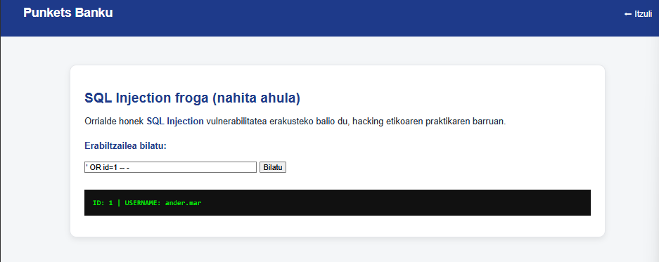

# iraunkortasuna

PUNKETS

Banku Punketsen Jasangarritasun Dokumentua

Txosten korporatiboa - Jasangarritasun Estrategia eta Praktikak

## Edukien Aurkibidea

\
1\. Banku Punketsen Ikuspegia\
2\. Jasangarritasunaren Kontzeptua\
3\. Nazioarteko Esparruak\
4\. Praktika Jasangarriak Banku Punkets-en\
5\. Ingurumen- eta Gizarte-Inpaktuen Efektua\
6\. Produkzio-Sektoreetan Eragina\
7\. Puntu Garrantzitsuak (Rúbrica)\
8\. KPI Grafikoak\
 

### 1. Banku Punketsen Ikuspegia

Banku Punkets bankua da, teknologia eta finantza zerbitzuetan liderra. Gure ikuspegia: jasangarritasuna gure produktuetan integratzea, hala nola kontu digitaletan eta kreditu berdeetan, eta bulegoetan energia-eraginkortasuneko neurriak ezartzea.

### 2. Jasangarritasunaren Kontzeptua

Gure bankuan jasangarritasuna hiru alderditan aplikatzen da:

• Ingurumenekoa: Datu-zentroetan energia berriztagarriak erabiltzen ditugu eta papera murrizteko dokumentu digitalak sustatzen ditugu.

• Soziala: Landa-eremuetan finantza inklusioa sustatzen dugu eta gure langileentzako prestakuntza eta lan-ingurune osasuntsua eskaintzen dugu.

• Ekonomikoa: Kreditu berdeak eta jasangarritasun-proiektuetarako finantzaketa eskaintzen dugu, gure bezeroei epe luzeko errentagarritasuna bermatuz.

### 3. Nazioarteko Esparruak

Agenda 2030 eta GJH: Gure kreditu berdeak eta energia-eraginkortasuneko proiektuak 8, 9, 12 eta 13. helburuekin lerrokatzen dira.

ISO 14001: Gure bulegoetan eta datu-zentroetan ingurumen-kudeaketa sistemak ezarri ditugu.

ESG Printzipioak: Gure jarduera neurtzen dugu ingurumen, gizarte eta gobernantzaren arabera, gardentasuna bermatuz.

### 4. Praktika Jasangarriak Banku Punkets-en

• Ingurumen-ekintzak: LED argiak eta energia berriztagarriak bulegoetan, ordenagailu zaharrak berrerabiltzeko programa, eta papera murrizteko digitalizazioa.

• Sozial-ekintzak: Bezeroentzako finantza-hezkuntza tailerrak eta arrakala digitala murrizteko aplikazio errazak.

• Ekonomiko-ekintzak: Jasangarritasun-proiektuetarako kredituak eta prozesuen digitalizazioa kostuak murrizteko.

### 5. Ingurumen- eta Gizarte-Inpaktuen Efektua

Ingurumen-inpaktua: Datu-zentroetan energia berriztagarriak erabiltzen ditugu eta hardwarearen berrerabilera sustatzen dugu e-waste murrizteko.

Gizarte-inpaktua: Landa-eremuetan finantza inklusioa eta segurtasun digitala bermatzen ditugu datuen babeserako protokoloekin.

### 6. Produkzio-Sektoreetan Eragina

Finantza sektorea: Kreditu berdeak eskaintzen ditugu energia-eraginkortasuneko proiektuetarako.

Hezkuntza: Finantza-hezkuntza digitala gazteei eta landa-eremuetako komunitateei.

Energia sektorea: IT sistemek energia berriztagarriak erabiltzen dituzte eta optimizazio-prozesuak ezarri ditugu.

### 7. Puntu Garrantzitsuak&#x20;

Ekipo elektronikoen berrerabilera:&#x20;

Ordenagailu zaharrak berrerabiltzeko eta berriz konfiguratze prozesua daukagu gure bulegoetan.

Ekipoen kutsadura aztarna:&#x20;

Datu-zentroetan energia berriztagarriak eta hornitzaile jasangarriak aukeratzen ditugu hardwarearen aztarna murrizteko.

Ekonomia Zirkularra:&#x20;

Papera murrizteko dokumentu digitalak eta hardwarearen berrerabilera sustatzen ditugu.

Agenda 2030 eta GJH:

&#x20;Kreditu berdeak eta energia-eraginkortasuneko proiektuak GJH helburuekin lotuta daude.

Jasangarritasunaren hiru alderdiak: Ingurumen, sozial eta ekonomiko ikuspegiak gure produktuetan eta estrategian integratzen ditugu.

\
\
\
 

## Jasangarritasunaren Hiru Alderdiak – Testu Prest

Jasangarritasuna Banku Punkets-en hiru ikuspegi nagusitan oinarritzen da: ingurumenekoa, soziala eta ekonomikoa. Alderdi hauek gure estrategian, produktuetan eta eguneroko jardueretan txertatuta daude modu sistematikoan.

#### &#x20;1. Ingurumen-aldarria (Ingurumen jasangarritasuna)

Banku Punkets-ek ingurumen-inpaktua murrizteko politika sendoak garatu ditu. Bulegoetan energia berriztagarriak erabiltzen ditugu, LED argiztapena eta energia-eraginkortasuneko neurriak ezarriz. IT sistemetan, datu-zentroak optimizatzen ditugu, zerbitzarien kontsumoa gutxitzeko virtualizazioa erabiliz. Gainera, papera murrizteko digitalizazio estrategia integrala daukagu eta ordenagailu zaharrak berrerabiltzeko programa sendoa dugu hondakin elektronikoa (e-waste) gutxitzeko. Helburu nagusia 2026rako gure aztarna ekologikoa %30 murriztea da.

#### &#x20;2. Gizarte-aldarria (Gizarte jasangarritasuna)

Dimentsio sozialean, gure lehentasuna bezeroen eta komunitateen ongizatea bermatzea da. Landa-eremuetan finantza-inclusioa sustatzen dugu, pertsona guztiek oinarrizko zerbitzu finantzarioetara sarbidea izan dezaten. Gure langileentzako lan-ingurune segurua eta osasuntsua bermatzen dugu: prestakuntza profesionala, aukera-berdintasuna eta lan-segurtasun protokolo sendoak ditugu. Bezeroentzako finantza-hezkuntza tailerrak eta segurtasun digitalerako aholkularitza eskaintzen ditugu, haien finantza-gaitasunak handituz eta arrakala digitala murriztuz.

#### &#x20;3. Ekonomia-aldarria (Ekonomia jasangarritasuna)

Alderdi ekonomikoan, Banku Punkets-ek epe luzerako errentagarritasuna eta baliabideen erabilera arduratsua uztartzen ditu. Kreditu berdeak eskaintzen ditugu energia berriztagarriko proiektuetarako, etxebizitza jasangarrien hipoteketarako eta enpresen trantsizio energetikoa errazteko. Produktu eta zerbitzu digitalizatuek kostuak murrizten dituzte eta bezeroei eraginkortasun handiagoa eskaintzen diete. Gainera, gure erabaki estrategikoak ESG printzipioetan (Ingurumena, Gizartea eta Gobernantza) oinarritzen dira, gardentasuna eta arrisku finantzarioaren kudeaketa jasangarria bermatuz.

\
\
\
\
\
\
\
\
\
\
\
\
\
\
\
\
\
\
\
\
\
\
\
\
 

## Agenda 2030 eta GJHak – Atal osoa (EUSKERA)

### Agenda 2030eko ikuspegia eta GJHen integrazioa

Banku Punkets-ek Nazio Batuen Agenda 2030 hartu du bere jarduera estrategikoen oinarri gisa. Gure helburua da gure produktu, zerbitzu eta barne-operazio guztiak Garapen Jasangarrirako Helburuekin (GJH) lerrokatzea, inpaktu neurgarri eta errealak sortuz ingurumenaren, gizartearen eta gobernantzaren arloetan.

### Estrategia orokorra

Agenda 2030 gure bankuan honako hiru ardatzen bidez txertatzen da:

1. Produktu eta zerbitzuen lerrokatzea GJH esanguratsuekin.\
    
2. Barne-operazio jasangarriak eta hornitzaile-kate arduratsua.\
    
3. KPIen bidezko neurketa, gardentasuna eta urteko txosten publikoak.\
    

Ardatz bakoitzak helburu kuantifikagarriak, epeak eta eragin-adierazleak ditu.

***

## 🎯 Guretzat lehentasunezkoak diren GJHak eta horien ekarpenak

### GJH 8 — Lan duina eta hazkunde ekonomikoa

Ekintzak:

* Langileentzako prestakuntza jarraitua eta lan-ingurune segurua.\
   
* Aukera-berdintasuna eta lan-arloko diskriminazioaren aurkako politika.\
   
* Landa-eremuetan enplegua eta finantza inklusioa sustatzea.\
   

KPIak:

* Urtero prestatutako langileen %.\
   
* Urteko txandaketa-tasa (turnover).\
   
* Delegazio berrietan tokiko kontratazioen %.\
   

Helburua 2026: Langileen %80 prestakuntza programetan, eta txandaketa-tasa %10 jaistea 2023arekiko.

***

### GJH 9 — Industria, berrikuntza eta azpiegitura

Ekintzak:

* Berrikuntza berdeko proiektuetarako finantzaketa.\
   
* Zerbitzu digitalen modernizazioa.\
   
* Datu-zentroetan eraginkortasun energetikoa eta virtualizazioa.\
   

KPIak:

* Proiektu jasangarri berritzaileetarako emandako kredituen bolumena (€).\
   
* Urtero garatutako produktu digital berriak.\
   
* kWh/operazio datu-zentroetan.\
   

Helburua 2026: Proiektu berde berritzaileentzako finantzaketa bikoiztea 2023arekiko.

***

### GJH 12 — Ekoizpen eta kontsumo arduratsua

Ekintzak:

* Ekonomia zirkularreko politika formala: ekipoen berrerabilera, papera murriztea, hornitzaile jasangarriak.\
   
* Hardware zaharraren berrerabilera eta e-waste murrizketa.\
   

KPIak:

* Berrerabilitako ekipamenduen %.\
   
* Urteko papera-kontsumoaren jaitsiera (orrialdeak).\
   
* ISO 14001 edo antzeko ziurtagiridun hornitzaileen %.\
   

Helburua 2026:

* Ekipo zaharren %60 berrerabiltzea.\
   
* Paper-kontsumoa %75 murriztea 2022ko oinarriarekin alderatuta.\
   

***

### GJH 13 — Klima-ekintza

Ekintzak:

* Bulego eta datu-zentroetan energia berriztagarriaren erabilera.\
   
* CO₂ aztarnaren kalkulua, jarraipena eta murrizketa.\
   
* Zerbitzarien optimizazioa emisioak gutxitzeko.\
   

KPIak:

* Emisioak (tCO₂e): Scope 1, 2 eta 3.\
   
* Energia berriztagarriaren %.\
   
* Urteko emisio-murrizketa portzentuala.\
   

Helburua 2026:

* CO₂ aztarna %30 murriztea 2023arekiko.\
   
* Bulegoetan kontsumitutako elektrizitatearen %100 berriztagarria izatea.\
   

***

### GJH 4, 5 eta 10 — Hezkuntza, genero-berdintasuna eta desberdintasunen murrizketa (transbertsalak)

Ekintzak:

* Finantza-hezkuntzako tailerrak gazteei eta landa-eremuetako komunitateei.\
   
* Genero-berdintasunerako politikak eta soldata-arrakalaren kontrola.\
   
* Dibertsitatea sustatzea zuzendaritza-postuetan.\
   

KPIak:

* Finantza-hezkuntza programen erabiltzaile kopurua.\
   
* Soldata-arrakala %.\
   
* Emakumeen presentzia zuzendaritzan.\
   

Helburua 2026:

* 10.000 lagun hezkuntza-finantzario programetan.\
   
* Soldata-arrakala < %5 izatea.\
   

***

## &#x20;Gobernantza eta jarraipen-mekanismoa

1. Gobernantza:\
   Jasangarritasun Batzorde Korporatiboak estrategia gainbegiratzen du eta GJHen betetze maila ebaluatzen du. Negozio-lerro bakoitzak ODS Owner bat du.\
    
2. Neurketa metodologia:\
   GHG Protocol, ESG estandar globalez eta barne KPI eguneratuez baliatzen gara.\
    
3. Tresnak eta sistemak:\
   KPI zentralizatuen dashboarda, hiruhileko eguneraketekin. Kanpo auditoretza urtean behin.\
    
4. Gardentasuna:\
   Urtero Jasangarritasun Txostena argitaratzen da; bertan hitzartutako helburuen betetze-maila azaltzen da.\
    
5. Erosketa arduratsua:\
   Hornitzaileentzako ESG irizpideak eta ingurumen- eta gizarte-baldintza lotesleak kontratuetan.\
    

***

## &#x20;GJHekin lotutako KPI integratuak

* CO₂ emisioak (Scope 1, 2, 3).\
   
* Energia berriztagarriaren %.\
   
* Berrerabilitako ekipoen %.\
   
* Kreditu berdeen bolumena (€).\
   
* Finantza-inklusio programen parte-hartzaile kopurua.\
   
* Hornitzaile jasangarrien %.\
   
* Berdintasun adierazleak (soldata-arrakala, zuzendaritzan emakumeen %).\
   

***

## &#x20;Konpromisoak eta egutegia

* 2024–2025: Oinarrizko datuen ezarpena, politika formalak idaztea, KPI lehen jarraipena.\
   
* 2026: Tarteko helburu nagusien betetzea (CO₂ -%30, berrerabilera %60…).\
   
* 2030: GJH nagusietan inpaktu neurgarria eta egiaztatua lortzea.\
   

***

Konpromiso adierazpena

Banku Punkets-ek bere negozio-estrategia Agenda 2030 eta GJHen printzipioetan oinarritzen du, bere jarduera ekonomiko, sozial eta ingurumenekoetan eragin positibo, gardena eta neurgarria sortzeko konpromiso irmoa hartuz.

\
\
\
\
\
 

### Etapas del ciclo de vida en un banco

#### 1. BALIABIDEAK (Inputs)

Lehengaiak erauztearen baliokidea.

* Kapital finantzarioa
* Energia elektrikoa
* IT azpiegitura (zerbitzariak, hodeia, softwarea)
* Eraikinak eta bulegoak
* Giza baliabideak
* Datuak eta informazio-sistemak

***

#### 2. Harrapaketa / Aprovisionamiento

Ustiapenaren baliokidea.

* Gordailuen captazioa
* Oinarrizko produktu finantzarioen jaulkipena
* Hornitzaile teknologikoen kontratazioa
* Kanpo-zerbitzuen erosketa (cloud, aholkularitza, segurtasuna)

***

#### 3. Lehen banaketa

Eraldaketa industrialaren baliokidea.

* Arrisku-analisia
* Transakzioen prozesamendua
* Kredituen ematea
* Inbertsioak eta aktiboen kudeaketa
* Ordainketen eta transferentzien kudeaketa

***

#### 4. Eraldakate (Proceso central)

Hasierako banaketaren baliokidea.

* Kanal digitalak (app, webgunea)
* Bulego fisikoak
* Kutxazain automatikoak
* Bitartekaritza-plataformak\
   

***

#### 5. Bigarren banaketa

Produktuaren birbanaketaren baliokidea.

* Maileguen abonua
* Interesen ordainketa
* Bezeroentzako finantza-zerbitzuak
* Eragiketen likidazioa

***

#### 6. Ekoizpena (Gate to Gate)

Atez ate: bankuaren barne-prozesuak.

* Core bankarioaren eguneroko operazioa
* Bezeroarentzako arreta
* Araudi-betetzea
* Zibersegurtasuna
* Sistemen mantentzea

***

#### 7. Bezeroentzako banaketa

* Finantza-produktuen erabilera
* Ordainketak, diru-ateratzeak, inbertsioak
* Zerbitzu digitalak eta presentzialak

***

#### 8.Erabilera

Zerbitzuaren bizi-fase aktiboa.

* Kontuen, maileguen eta txartelen bizi-iraupena
* Bezero-banku etengabeko interakzioa
* Kontsumo energetiko digitala (appak, zerbitzariak)

***

\
\
 

#### 9. Bizi-amaiera

Produktuaren amaieraren baliokidea.

* Kontuen itxiera
* Finantza-produktuen baliogabetzea
* Datuen artxiboa edo ezabatzea
* Azpiegituren desmuntaketa
* Ekipo elektronikoen birziklapena

***

### sistemaren mugak

* De la cuna a la puerta (Cradle to Gate)\
  Desde los recursos hasta la operación bancaria.
* De la puerta a la puerta (Gate to Gate)\
  Procesos internos del banco.
* De la cuna a la tumba (Cradle to Grave)\
  Incluye uso del servicio y fin de vida.
* De la cuna a la cuna (Cradle to Cradle)\
  Reutilización de recursos: digitalización, economía circular, reutilización de datos y equipos.

***

### ebaluatu daiteezken inkatu tipikoak

* Consumo energético
* Emisiones indirectas (Scope 2 y 3)
* Huella digital
* Impacto social y económico
* Cumplimiento ESG

<figure><figcaption></figcaption></figure>

\
\
 

#### Gure ekarpena iraunkortasunean (de la cuna a la tumba)

Punkets bankuan, iraunkortasuna gure jardueraren ardatz nagusietako bat da, eta produktu eta zerbitzuen bizi-ziklo osoa hartzen du kontuan, sehaskatik hilobira.

Hasieratik bertatik, irtenbide digitalak eta prozesu eraginkorrak diseinatzen ditugu, baliabideen kontsumoa murrizteko eta ingurumen-inpaktua minimizatzeko. Zerbitzuak eskaintzerakoan, gardentasuna, erabilera arduratsua eta finantza-hezkuntza sustatzen ditugu, gizartearentzat balio iraunkorra sortzeko.

Era berean, gure ingurumen-aztarna txikitzeko lanean ari gara: paperaren erabilera murriztuz, energia-eraginkortasuna hobetuz eta irizpide sozial eta ingurumenekoekin lerrokatutako bazkide eta hornitzaileekin elkarlanean.

Zikloaren amaieran, baliabideen berrerabilera, datuen kudeaketa arduratsua eta produktu eta zerbitzuen itxiera egokia sustatzen ditugu. Horrela, Punkets-ek etorkizun jasangarriago baten aldeko konpromisoa berresten du, pertsonak, gizartea eta ingurumena erdigunean jarriz.

 
