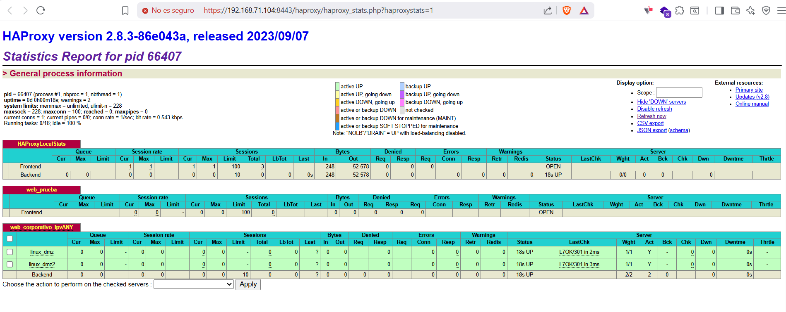

# HAProxy

Enpresaren pfSense sisteman HAProxy instalatu dugu, web zerbitzua kudeatzeko. Konfigurazio horrek bi web nodo erabiltzen ditu, karga banatzeko eta zerbitzuaren erabilgarritasuna eta fidagarritasuna hobetzeko.

<figure><figcaption></figcaption></figure>

<figure><figcaption></figcaption></figure>

<figure><figcaption></figcaption></figure>
